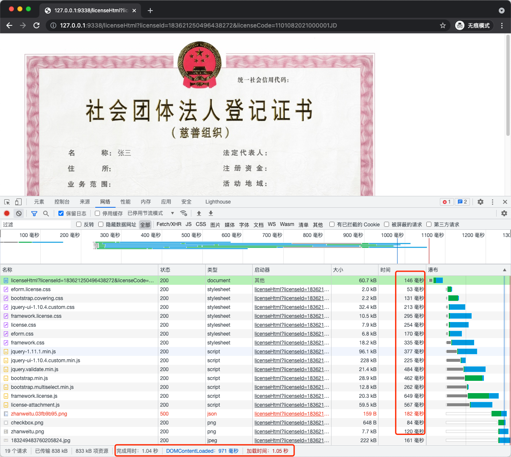

# Garnish - simple varnish implementation written in Go

Garnish is an example of a simple varnish implementation which should demonstrate.

It supports only `Cache-Control` header and keeps all the data in memory. It means that after restart of the application
all data will disappear.

The project was described in more details in [the article](https://developer20.com/garnish-simple-varnish-in-go/).

## usage example

1. `garnish -time 1h -proxy http://192.168.112.228:11009/ -cache g.db`
   force cache for an hour to target and use bolddb as cache store with name `g.db`. And `g.db` can be used separately
   like `garnish -cache g.db`.
2. `garnish -time 1h -proxy http://192.168.112.228:11009/`
   same with above other than with memory caching.
3. `garnish -proxy http://192.168.112.228:11009/`
   cache in memory according to response header `Cache-Control`, like `Cache-Control: max-age=123`.

## boltdb diff between first and cached

`garnish -force 1h -proxy http://192.168.112.228:11009/ -cache g.db`

`garnish -force 1h -proxy http://192.168.112.228:11009/`

